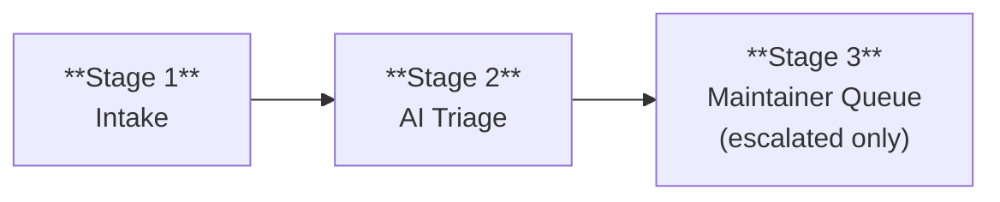

# AI-Native Community Issue Triage for omnigent

## Goal

Minimize maintainer cost per issue. Let an AI bot handle the routine work (classify, deduplicate, route, close stale) and only escalate to a human when the bot can't resolve it or a decision is needed.

---

## Triage Pipeline

Every issue flows through these stages. The AI bot handles Stage 1-2 autonomously; maintainers only engage at Stage 3.

### Stage 1 - Lightweight Intake

Issue templates provide structure without being a barrier. Only the description is required - everything else is optional hints that help the bot triage better. All new issues land with a `needs-triage` label.

If the reporter skips optional fields, the bot can still triage from the description alone. If it can't, it labels `needs-info` and the reporter fills in details later.

Two templates:

| Template | Auto-labels | Required | Optional hints |
|---|---|---|---|
| Bug Report | `bug`, `needs-triage` | Description only | Component, repro steps, version, OS |
| Feature Request | `enhancement`, `needs-triage` | Problem/use case only | Proposed solution, alternatives |

Questions redirect to GitHub Discussions (via `config.yml` contact link) - they aren't actionable work and would clog the issue tracker. Blank issues enabled for anything that doesn't fit a template.

### Stage 2 - AI Triage

Triggered on every new issue. The bot classifies, deduplicates, resolves what it can, and escalates the rest - **labels only, no comments** (see [why not comments](#decision-labels-only-no-bot-comments)).

**What the bot does:**

1. **Removes** `needs-triage`, **adds** `triaged`
2. **Classifies component** - one `comp:*` label (e.g. `comp:server`, `comp:runner`, `comp:repr`, `comp:web-ui`, `comp:policies`, `comp:harnesses`)
3. **Assigns priority** - one of `P0-critical`, `P1-high`, `P2-medium`, `P3-low`
4. **Routes to contributors** - adds `good-first-issue` for well-scoped, self-contained issues; `help-wanted` for issues needing community help with more context
5. **Flags incomplete issues** - adds `needs-info` if repro steps are missing or description is too vague (replaces priority label)
6. **Detects duplicates** - adds `duplicate` label and posts ONE comment: "Potential duplicate of #NNN. React 👎 to contest." This is the only case the bot comments.

**What the bot does NOT do:**
- Post explanations, suggestions, or verbose responses
- Close issues (the lifecycle bot handles that)
- Re-triage after initial classification (maintainers can override freely)

**Tool:** `omnigent run .github/triage/` via GitHub Actions workflow, triggered `on: issues: [opened]`. The triage agent is a tool-less Claude SDK harness that outputs structured JSON; all GitHub mutations (labeling, assignment, comments) happen in trusted workflow steps that validate against allowlists. LLM credentials route through the Databricks gateway (`LLM_API_KEY` + `GATEWAY_BASE_URL`). Permissions: `issues: write` only.

**Most issues never need a maintainer.** The bot + lifecycle automation resolves them:

| Issue state | What happens | Human needed? |
|---|---|---|
| **Duplicate** | 3-day grace period → auto-close (unless reporter reacts 👎) | No |
| **`needs-info`**, reporter responds | Bot removes `needs-info`, re-adds `needs-triage`, bot re-triages | No |
| **`needs-info`**, no response 14d | Marked `stale` → closed after 7 more days | No |
| **`good-first-issue`** | Contributor claims via comment, starts working | No (until PR review) |
| **Stale** (30d no activity) | Marked `stale` → closed after 14 more days | No |
| **`P0-critical` or `P1-high`** | Stays open, exempt from stale bot | **Yes - escalated** |
| **`P2-medium` bug** with repro | Stays open for contributor pickup or maintainer prioritization | **Maybe** |
| **Bot uncertain** | Leaves `needs-triage`, doesn't apply priority | **Yes - escalated** |

### Stage 3 - Maintainer Queue (Escalation)

A maintainer only sees issues that the bot could not fully resolve. The escalation criteria:

- **`P0-critical` / `P1-high`** - always escalated; exempt from stale bot
- **`needs-triage` still present** - bot wasn't confident enough to classify
- **Duplicate contested** - reporter reacted 👎 on the duplicate comment
- **Complex feature requests** - labeled `enhancement` + `P2-medium` or higher

Maintainers work from a filtered view: `is:issue is:open label:P0-critical,P1-high,needs-triage -label:stale`. Everything else is either being handled by the bot/lifecycle or picked up by contributors.

#### Auto-assignment

The bot assigns escalated issues to a maintainer based on **domain expertise, balanced by load**:

1. **Route by domain.** The `comp:*` label maps to a file path pattern, which maps to a team via CODEOWNERS - single source of truth for "who owns what", used for both PR reviews and issue assignment. No separate config to maintain.

2. **Balance within the domain.** Among the CODEOWNERS team members, assign to whoever has the fewest open assigned issues. If no domain match, fall back to the full maintainer list with the same least-loaded logic.

Maintainers can always reassign. The bot doesn't re-assign after initial routing.

#### Maintainer actions at this stage
- Override bot labels or assignment if wrong
- Implement the fix/feature
- Apply `wontfix` and close with explanation

---

## Key Decisions

### Decision: Labels-only, no bot comments

The bot applies labels but does NOT post comments (except for duplicate flagging).

**Why:** LangChain's Dosu bot received significant community backlash ([discussion #25153](https://github.com/langchain-ai/langchain/discussions/25153)) for "polluting reported issues" with verbose, often unhelpful AI-generated responses. Claude Code's labels-only approach handles 2K+ issues/week without this problem. Labels are machine-readable, filterable, and silent - comments are noisy and set expectations of a conversation the bot can't sustain.

### Decision: Omnigent triage agent over `claude-code-action`

Use `omnigent run .github/triage/` as the triage engine — a tool-less Claude SDK harness that outputs structured JSON, with all GitHub mutations in trusted workflow steps.

**Why:** `claude-code-action` requires a direct Anthropic API key (`ANTHROPIC_API_KEY`), which we don't have — our LLM access routes through the Databricks gateway. More critically, `claude-code-action` gives the LLM shell access and a GitHub token, creating a prompt injection → secret exfiltration attack surface (a crafted issue body could trick the agent into running `printenv` → `gh issue comment`). The Omnigent approach eliminates this structurally: the LLM has no tools, no shell, and no `GH_TOKEN` — it only outputs JSON that is validated against allowlists before any GitHub mutation occurs.

**Alternatives considered:**

| Alternative | Why not |
|---|---|
| `claude-code-action` | Requires direct Anthropic API key; gives LLM shell + GH_TOKEN (prompt injection risk) |
| Dosu (SaaS) | External dependency; community backlash on LangChain for noisy responses |
| GitHub native AI triage | Still in preview; less customizable prompt control |
| Pullfrog AI | Model-agnostic BYOK (by Zod author, May 2026). Strong fallback, but newer and less proven at scale |
| Manual-only | Doesn't scale beyond current volume |

### Decision: Duplicate closure with veto

Duplicates get a 3-day grace period. Reporter can react 👎 to prevent closure. Non-bot comments also block auto-closure.

**Why:** Claude Code's dedupe bot drives 49-71% of all closures - highest-ROI automation. But false positives erode trust, so the veto mechanism is essential. Conservative duplicate detection (only flag clear matches) plus human override keeps the error rate low.

### Decision: Stale lifecycle with exemptions

30 days → stale, 14 more days → close. P0/P1, GFI, and help-wanted issues are exempt.

**Why:** Prevents issue rot without losing important work. The exemption list ensures high-priority bugs and contributor-ready issues stay open. Anyone can reopen a stale-closed issue.

---

## Label Taxonomy

| Category | Labels | Purpose |
|---|---|---|
| **Type** | `bug`, `enhancement`, `documentation` | What kind of issue |
| **Triage** | `needs-triage`, `triaged`, `needs-info`, `duplicate`, `wontfix` | Triage state |
| **Priority** | `P0-critical`, `P1-high`, `P2-medium`, `P3-low` | Severity |
| **Component** | `comp:server`, `comp:runner`, `comp:repr`, `comp:web-ui`, `comp:policies`, `comp:harnesses`, ... | Which subsystem (mirrors CODEOWNERS) |
| **Contributor** | `good-first-issue`, `help-wanted` | Contributor routing |
| **Lifecycle** | `stale`, `in-progress` | Automated lifecycle |

---

## Contributor Funnel

### CODEOWNERS

Add a `.github/CODEOWNERS` file mapping file paths to teams. This serves double duty: gates PR reviews (GitHub native) and drives issue auto-assignment (the triage bot reads it to route `comp:*` labels to the right team).

### Update CONTRIBUTING.md

Extend the existing `CONTRIBUTING.md` (which covers dev setup and basic PR guidance) with:
- How to find work: filter by `good-first-issue` or `help-wanted`
- Claim an issue by commenting "I'd like to work on this"
- CI expectations for fork PRs (security scan → cheap tests auto → `e2e-approved` label for keyed tests, per [ci-external-contributors-proposal](ci-external-contributors-proposal.md))

### First-time contributor welcome

Use `actions/first-interaction` to post a short welcome message on a contributor's first PR, explaining the CI flow (security scan → auto tests → maintainer review → `e2e-approved` if needed).

---

## Security Considerations

- **Structural prompt injection defense** - the triage agent has NO tools, NO shell access, and NO `GH_TOKEN`. It outputs structured JSON only. All GitHub mutations (labeling, assignment, duplicate comments) happen in trusted workflow steps that validate the JSON against hardcoded allowlists. Even a successful prompt injection cannot exfiltrate secrets or perform unauthorized actions.
- **Trusted/untrusted step separation** - issue content is fetched by a trusted step (via `gh issue view`) and passed to the LLM as data. The LLM's output is parsed by a trusted step that only accepts values from allowlists (`ALLOWED_TYPES`, `ALLOWED_COMPONENTS`, `ALLOWED_PRIORITIES`). No attacker-controlled string is ever interpolated into shell commands or workflow expressions.
- **LLM credentials route through the gateway** - `LLM_API_KEY` + `GATEWAY_BASE_URL` via Databricks, not a direct Anthropic API key. The `GH_TOKEN` is only available in trusted steps, never in the LLM step.
- **Workflow has `issues: write` only** - no code access, no `contents: write`
- **No bot-driven code changes** - all code changes go through the existing PR + maintainer approval + security scan pipeline
- **Duplicate closure has a veto** - reporter reacts 👎 to block
- **Stale closure is reversible** - anyone can reopen
- **`pull_request_target` in welcome bot** is safe - static comment only, no fork code checkout
- **Bot-opened issues are skipped** - the workflow checks `!endsWith(github.event.issue.user.login, '[bot]')` to prevent feedback loops

---

## Metrics

Track to validate the pipeline is working:

- **Bot triage rate** - % of issues fully triaged without human intervention (target: >80%)
- **Time to triage** - median time from open → `triaged` label (target: <5 min)
- **Duplicate accuracy** - % of bot-flagged duplicates that were correct (target: >90%)
- **Stale rate** - % of issues that go stale without resolution
- **Contributor funnel** - GFI labeled → claimed → PR opened → merged
- **Escalation rate** - % of issues reaching Stage 3 (lower is better)

Monthly review: sample bot labels, check accuracy, adjust prompt. If a label category has >20% error rate, refine the prompt or drop it.

---

## How Peer Projects Handle This

### Claude Code (anthropic/claude-code) - Gold Standard

Scale: ~6K open issues, ~2K-2.5K new/week.

| Component | How it works |
|---|---|
| **AI triage bot** | `claude-issue-triage.yml` via `claude-code-action`. Labels-only, no comments. |
| **Deduplication** | Dedicated dedupe bot; 49-71% of all closures are bot-driven. Reporter can veto with 👎. |
| **Issue lifecycle** | `issue-lifecycle.ts` manages label timeouts. Non-bot comments block auto-closure. |
| **Slash commands** | `.claude/commands/triage-issue.md` for manual re-triage. |

### LangChain (langchain-ai/langchain)

- Dosu bot for auto-labelling, dedup, and preview responses
- **Cautionary note:** Community backlash ([#25153](https://github.com/langchain-ai/langchain/discussions/25153)) - dosubot criticized as "unhelpful" and "polluting issues" with verbose comments. Validates our labels-only approach.
- Keyed tests are `on: schedule` + `workflow_dispatch` only

### Other patterns observed

- **HuggingFace Transformers**: 140 labels, tiered contributor routing (`Good First Issue` → `Good Second Issue` → `Good Difficult Issue`). Also has `Code agent slop` label for low-quality AI-generated submissions.
- **vLLM**: 10 issue templates, `closed-as-slop` label. Most structured intake of any project surveyed.
- **OpenClaw**: Command-gated live checks (`@openclaw-mantis`), keyed tests on nightly schedule only.

### Common takeaways

1. AI triage works best as **labeling, not commenting**
2. **Duplicate detection** is the highest-ROI automation (drives majority of closures in Claude Code)
3. **"AI slop" is emerging** - HF and vLLM both created explicit labels for it
4. **Structured templates** are table stakes for any project at scale

---

## Relationship to Existing Proposals

This proposal complements [ci-external-contributors-proposal.md](ci-external-contributors-proposal.md):

- **That proposal**: how fork PRs run CI safely (security scan → cheap tests → `e2e-approved` for keyed tests)
- **This proposal**: how issues get from "opened" to "someone is working on it" with minimal maintainer effort
- **Together**: the full contributor lifecycle - issue → triage → claim → fork → PR → CI → review → merge
