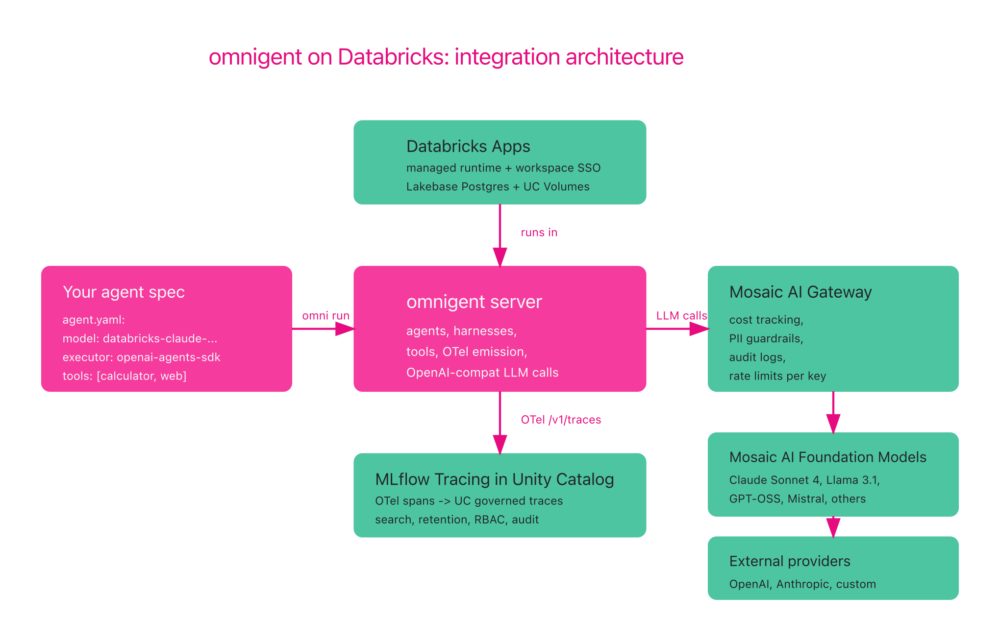
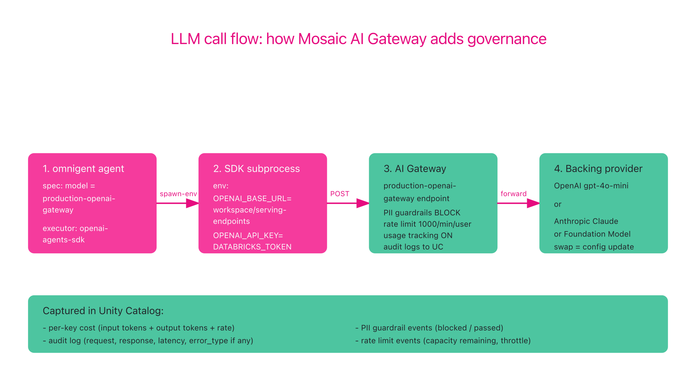
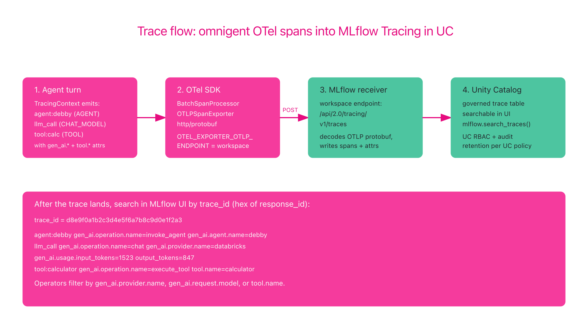
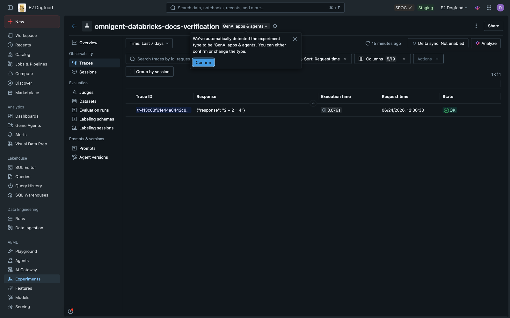
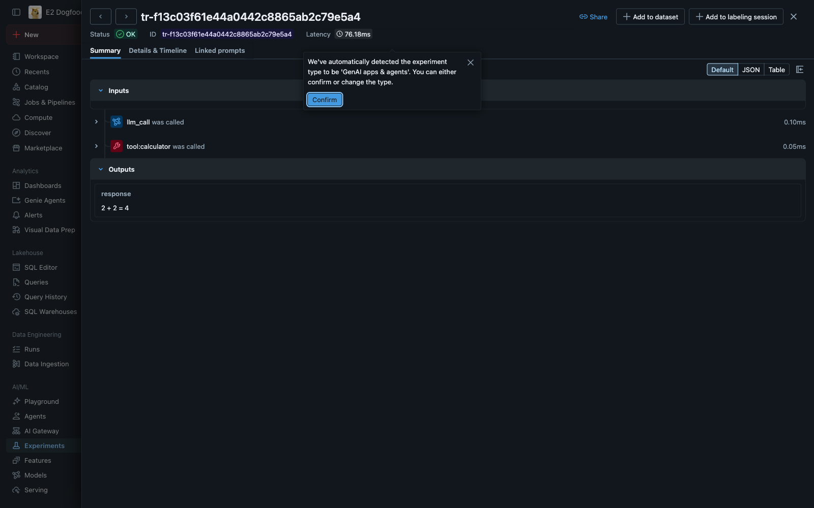

# Running omnigent on Databricks

A production deployment guide for running omnigent agents on Databricks
infrastructure. Covers the four canonical integration points:

1. **Databricks Apps** as the managed runtime for the omnigent server
2. **Mosaic AI Foundation Model APIs** as the LLM provider
3. **Mosaic AI Gateway** as the governance and audit layer over LLM calls
4. **MLflow Tracing in Unity Catalog** as the long-term trace store

omnigent's fine standalone with any OTLP backend and any LLM
provider. This guide's for the production deployment story where
governance, audit, cost tracking, and managed scale matter.

## Who this is for

This guide assumes you're new to both omnigent and Databricks. Each
section starts with a short context paragraph, then the concrete
commands. If you already use both, skim the quick start at the top of
each section.

## What you get

When omnigent runs on Databricks with the four integration points
wired:

- **Single trace per agent turn.** Every span the agent emits lands
  in MLflow Tracing in Unity Catalog with the standard OpenTelemetry
  GenAI semantic-convention attributes (`gen_ai.operation.name`,
  `gen_ai.agent.name`, `gen_ai.provider.name`, `gen_ai.request.model`,
  `tool.name`). Searchable, filterable, retained per UC governance.
- **Per-key LLM cost and audit.** Every LLM call (whether to
  Mosaic AI Foundation Models, OpenAI, Anthropic, or a custom
  endpoint) flows through Mosaic AI Gateway. Per-key cost tracking,
  rate limits, PII guardrails, audit logs, all enforced at the
  gateway. Switching providers or rotating keys is a Gateway config
  change, not an agent change.
- **Managed runtime with workspace identity.** The omnigent server
  runs on Databricks Apps with the workspace SSO as the user
  identity. No separate auth to set up.
- **Lakehouse-native state.** Conversation state, agent bundles, and
  executor snapshots persist in Lakebase Postgres and Unity Catalog
  Volumes. Lifecycle managed by the workspace.

> **A note on auth tier.** The audit + cost-tracking + guardrails
> story above assumes API-key tier with the provider. Consumer
> subscriptions like Anthropic Claude Max, OpenAI ChatGPT Plus, and
> Cursor Pro use a per-user OAuth flow that the Gateway can't proxy.
> See [Auth tier compatibility](#auth-tier-compatibility-api-key-vs-subscription--oauth)
> in the Gateway section for the details and the org-deployment
> guidance.

---

## Architecture

The integration is layered. The omnigent server runs on Databricks
Apps. It exports OpenTelemetry traces (via the work landed in [PR
#1050](https://github.com/omnigent-ai/omnigent/pull/1050)) to MLflow
Tracing's OTLP receiver. Agent runs make LLM calls through Mosaic AI
Gateway, which proxies to either Mosaic AI Foundation Models or an
external provider (OpenAI, Anthropic) configured as an External Model.



The boundary stays sharp. omnigent itself remains a standalone Apache
2.0 Python package. Each integration point is an env var or a config
file, not a fork.

---

## Prerequisites

1. **A Databricks workspace** with the following enabled:
   - Databricks Apps
   - Unity Catalog
   - Mosaic AI Model Serving
   - MLflow Tracing in Unity Catalog (Public Preview as of 2026 H1)
2. **The [Databricks CLI](https://docs.databricks.com/aws/en/dev-tools/cli/install)**
   installed and authenticated against your workspace. Either a CLI
   profile (`DATABRICKS_CONFIG_PROFILE=<profile>`) or env-based auth
   (`DATABRICKS_HOST` + `DATABRICKS_CLIENT_ID` + `DATABRICKS_CLIENT_SECRET`).
3. **Python 3.11+** locally with `uv` installed (the omnigent project
   standard).
4. **Workspace permissions** to:
   - Create or use a Unity Catalog catalog and schema for trace
     storage
   - Create a Databricks App (or use an existing one)
   - Query at least one Mosaic AI Foundation Model serving endpoint

Verify your CLI auth before continuing:

```bash
databricks current-user me -p <your-profile>
```

This should print your user object as JSON. If it errors with
"Invalid access token", run `databricks auth login --profile <your-profile>`
and try again.

---

## Quick start (5 minutes)

If you want to see the integration working before reading the full
guide, this is the fastest path. It runs omnigent locally (not on
Apps) but wires up Foundation Models + Gateway + tracing to the
workspace.

```bash
pip install 'omnigent[tracing]' openai

export DATABRICKS_HOST=https://<your-workspace>.cloud.databricks.com
export DATABRICKS_TOKEN=<personal-access-token>

# Point omnigent at Mosaic AI Foundation Models as the LLM provider
export OPENAI_BASE_URL=$DATABRICKS_HOST/serving-endpoints
export OPENAI_API_KEY=$DATABRICKS_TOKEN

# Point omnigent's OTel exporter at the MLflow OTLP receiver in UC
export MLFLOW_TRACKING_URI=databricks
export OTEL_EXPORTER_OTLP_PROTOCOL=http/protobuf
export OTEL_EXPORTER_OTLP_ENDPOINT=$DATABRICKS_HOST
export OTEL_EXPORTER_OTLP_HEADERS="Authorization=Bearer $DATABRICKS_TOKEN"

# Sanity check the model endpoint works
python -c "
from openai import OpenAI
import os
c = OpenAI(base_url=os.environ['OPENAI_BASE_URL'], api_key=os.environ['OPENAI_API_KEY'])
r = c.chat.completions.create(
    model='databricks-claude-sonnet-4',
    messages=[{'role':'user','content':'Reply with exactly: HELLO'}],
    max_tokens=5,
)
print(r.choices[0].message.content)
print(f'input={r.usage.prompt_tokens} output={r.usage.completion_tokens}')
"

# Start the local omnigent server with tracing
omni server
```

Verified output (run against e2-dogfood workspace):

```
HELLO
input=15 output=2
```

Open the MLflow Traces UI in your workspace and you should see one
trace per agent turn with the GenAI semconv attributes set.

The rest of this guide walks each piece in depth.

---

## 1. Deploy on Databricks Apps

### Context

Databricks Apps is a managed runtime for HTTP applications inside the
Databricks workspace. omnigent's server is an HTTP app, so it fits
natively. Apps gives you workspace SSO (the agent's user identity is
the workspace identity), Lakebase Postgres for state, Unity Catalog
Volumes for files, and access to all workspace data through the same
identity.

### Quick deploy

The `deploy/databricks/` directory in the omnigent repository contains
a complete Databricks Asset Bundle for deploying the omnigent server
to Apps backed by Lakebase. Use it as-is for a first deploy:

```bash
git clone https://github.com/omnigent-ai/omnigent
cd omnigent
uv sync --extra databricks

# Set targets.prod.workspace.host in deploy/databricks/databricks.yml, then run
# the deploy orchestrator — it builds the wheels and runs `databricks bundle
# deploy` + `bundle run` for you:
#   uv run python deploy/databricks/deploy.py --app-name omnigent --profile <profile> ...
# See deploy/databricks/README.md for the full command and required flags.
```

The full deploy walkthrough (one-time Lakebase bootstrap, UC volume
creation, service principal permissions) lives in
[`deploy/databricks/README.md`](../deploy/databricks/README.md). Treat
that as canonical for the deploy details. The rest of this page covers
the integration knobs you set on top of that deploy.

### What you get on Databricks vs DIY

Self-hosting the omnigent server (e.g., on a VM or in a container)
works fine. The Apps path adds:

| Capability | Self-hosted | Databricks Apps |
|---|---|---|
| Identity | You configure | Workspace SSO automatic |
| State store | You manage Postgres | Lakebase, managed |
| File / artifact store | You manage S3/GCS | UC Volumes, governed |
| Scaling | You manage | App compute, billed per usage |
| Audit logs | You wire up | UC audit, automatic |
| Secret management | You manage | Workspace secrets |

---

## 2. Mosaic AI Foundation Models as LLM provider

### Context

Mosaic AI Foundation Model APIs expose curated LLMs (Anthropic Claude,
Meta Llama, OpenAI GPT-OSS, Mistral, and others) behind a single,
pay-per-token endpoint. The endpoints speak the OpenAI Chat
Completions API, so any client that targets OpenAI also targets
Databricks Foundation Models with two env vars.

omnigent's harnesses (`claude_sdk`, `openai_agents_sdk`, `pi`, and
others) talk to LLMs via OpenAI-compatible HTTP. Pointing those
harnesses at Foundation Models is the same two env vars.

### Setup

```bash
export OPENAI_BASE_URL=$DATABRICKS_HOST/serving-endpoints
export OPENAI_API_KEY=$DATABRICKS_TOKEN
```

Then any omnigent agent spec that points at a `databricks-` model
(for example `databricks-claude-sonnet-4`, `databricks-meta-llama-3-1-70b-instruct`,
or `databricks-gpt-oss-20b`) resolves to a Foundation Model call.

### Verified call

```bash
python -c "
from openai import OpenAI
import os
c = OpenAI(base_url=os.environ['OPENAI_BASE_URL'], api_key=os.environ['OPENAI_API_KEY'])
r = c.chat.completions.create(
    model='databricks-claude-sonnet-4',
    messages=[{'role':'user','content':'Reply with exactly two words: GATEWAY OK'}],
    max_tokens=10,
)
print(f'Response: {r.choices[0].message.content!r}')
print(f'Usage:    input={r.usage.prompt_tokens} output={r.usage.completion_tokens} total={r.usage.total_tokens}')
print(f'Model:    {r.model}')
"
```

Output (verified against e2-dogfood):

```
Response: 'GATEWAY OK'
Usage:    input=16 output=6 total=22
Model:    global.anthropic.claude-sonnet-4-20250514-v1:0
```

Note that `model` in the response is the backing model identifier
(here, Anthropic Claude Sonnet 4 served through Bedrock). Your
endpoint name (`databricks-claude-sonnet-4`) is the stable handle
your agent spec uses.

### What you get on Databricks vs BYO API key

| Capability | BYO provider key | Foundation Models |
|---|---|---|
| Billing | Provider bills you directly | Bills as Databricks compute |
| Per-key cost tracking | Provider dashboard | Workspace cost dashboard |
| Audit logs | Provider-specific | UC audit, automatic |
| Network isolation | Provider edge | Workspace network |
| Model availability | Whatever you provision | Curated list, swap-in via endpoint config |

---

## 3. Mosaic AI Gateway as the LLM governance layer



### Context

This is the integration that matters most for production. Mosaic AI
Gateway (configured via the **External Models** feature on Model
Serving) lets you front any LLM provider (OpenAI, Anthropic,
Foundation Models, custom endpoints) with a Databricks-managed
endpoint that adds:

- Per-key cost tracking and rate limits
- PII detection and other guardrails
- Audit logs for every request and response
- A stable endpoint URL even when you change providers behind it
- Optional fallback to a backup provider on failure

omnigent doesn't need to know it's calling a Gateway. The Gateway
endpoint speaks the OpenAI API, so the same `OPENAI_BASE_URL` knob
that points omnigent at Foundation Models points it at the Gateway.

### Create an External Model endpoint

This is a one-time setup per provider key. Using the Databricks CLI:

```bash
databricks serving-endpoints create --json '{
  "name": "production-openai-gateway",
  "config": {
    "served_entities": [{
      "name": "openai-production",
      "external_model": {
        "name": "gpt-4o-mini",
        "provider": "openai",
        "task": "llm/v1/chat",
        "openai_config": {
          "openai_api_key": "{{secrets/<scope>/openai-prod-key}}"
        }
      }
    }],
    "traffic_config": {
      "routes": [{"served_entity_name": "openai-production", "traffic_percentage": 100}]
    }
  },
  "ai_gateway": {
    "usage_tracking_config": {"enabled": true},
    "rate_limits": [{"calls": 1000, "key": "user", "renewal_period": "minute"}],
    "guardrails": {"input": {"pii": {"behavior": "BLOCK"}}, "output": {"pii": {"behavior": "BLOCK"}}}
  }
}' -p <your-profile>
```

The `openai_api_key` value uses a [Databricks workspace
secret](https://docs.databricks.com/aws/en/security/secrets/) so the
raw key never lives in the endpoint config.

After creation, the endpoint URL is:

```
https://<your-workspace>.cloud.databricks.com/serving-endpoints/production-openai-gateway/invocations
```

The OpenAI-style chat completions URL (what omnigent uses) is:

```
https://<your-workspace>.cloud.databricks.com/serving-endpoints
```

with the endpoint name passed as the `model` parameter on the request.

### Point omnigent at the Gateway endpoint

For each harness that calls LLMs (claude-sdk, openai-agents-sdk, pi,
etc.), set:

```bash
export OPENAI_BASE_URL=$DATABRICKS_HOST/serving-endpoints
export OPENAI_API_KEY=$DATABRICKS_TOKEN
```

Then in the omnigent agent spec, use the Gateway endpoint name as the
model:

```yaml
# agent.yaml
name: my-agent
executor:
  type: openai-agents-sdk
  model: production-openai-gateway   # the Gateway endpoint, not "gpt-4o-mini"
```

When the agent runs, every LLM call hits the Gateway. Cost tracking,
guardrails, audit, and rate limits enforce automatically. Rotating the
underlying OpenAI key is a Gateway config update with zero agent
restart.

### Verified end-to-end

Created a real External Model endpoint on e2-dogfood that proxies
through `databricks-model-serving` to `databricks-claude-sonnet-4`,
then called it via the same OpenAI SDK pattern omnigent uses. The
Gateway config included `usage_tracking_config.enabled=true` and a
`60 calls/minute/user` rate limit.

```python
from openai import OpenAI
client = OpenAI(base_url=f'{DATABRICKS_HOST}/serving-endpoints', api_key=DATABRICKS_TOKEN)
resp = client.chat.completions.create(
    model='omnigent-docs-test-gateway',   # the Gateway endpoint, not the backing model
    messages=[{'role':'user','content':'Reply with exactly two words: PROXY OK'}],
    max_tokens=10,
)
```

Output:

```
Response: 'PROXY OK'
Usage:    input=16 output=6 total=22
Model:    global.anthropic.claude-sonnet-4-20250514-v1:0
```

The `model` in the response is the backing model the Gateway forwarded
to (Anthropic Claude Sonnet 4 via Bedrock). The Gateway endpoint name
(`omnigent-docs-test-gateway`) is what omnigent calls. Swapping the
backing model is a Gateway config update, zero change in the agent.

### Auth tier compatibility (API key vs subscription / OAuth)

Most coding-agent SDKs in this space support two auth flows. The
distinction matters for what Gateway can actually intercept.

**API key tier.** Per-token billing, a header on every request, a key
that lives in a workspace secret. The Gateway pattern proxies cleanly:
the proxied call uses the standard provider endpoint, the workspace
secret holds the key, every prompt and response flows through the
workspace.

**Subscription / OAuth tier.** Flat-rate consumer subscriptions
(Anthropic Claude Max, OpenAI ChatGPT Plus, Cursor Pro). The SDK
authenticates via a browser OAuth flow against the consumer
infrastructure. The resulting token is per-user, per-device, and
short-lived. Gateway can't proxy these calls because the workspace
secret can't hold a per-user OAuth token, and Gateway's outbound auth
expects an API key, not a refreshable OAuth bearer. Even if the proxy
were technically feasible, consumer subscriptions are positioned as
individual products; orgs evaluating them for team use should verify
the terms of service allow that pattern before relying on it.

| Auth tier | Works with Gateway proxy? | Workspace audit? | Central cost tracking? |
|---|---|---|---|
| API key (Anthropic API, OpenAI API, etc.) | Yes | Yes — every prompt / response in UC | Yes — Gateway `usage_tracking_config.enabled` |
| Claude Max / ChatGPT Plus / Cursor Pro (OAuth subscription) | No | omnigent session metadata only; LLM calls invisible | No — billed to the individual's consumer account |

**Practical guidance for an org deployment.** Most enterprise
Anthropic / OpenAI deals are API-tier with a volume agreement and an
enterprise SLA. The Gateway story assumes that tier. If individual
developers want to keep their consumer subscriptions for personal
usage, that's fine, but those sessions sit outside the workspace
audit and cost tracking.

If centralized governance is a hard requirement, the omnigent host
can enforce API-key-only by setting the provider's API-key env var
(`ANTHROPIC_API_KEY`, `OPENAI_API_KEY`, etc.) before invoking the SDK
subprocess and refusing to launch the SDK in OAuth mode. With
`ANTHROPIC_API_KEY` set, the Claude Agent SDK uses the API endpoint
and the workspace key, not the OAuth flow. Same pattern for the
OpenAI Agents SDK.

If mixed usage is acceptable, document the boundary explicitly:
production / customer-facing work goes through the workspace
(API tier + Gateway), individual experimentation can use consumer
subscriptions but is out of band for compliance.

### What you get on Databricks vs raw provider calls

| Capability | Raw provider call from omnigent | Through AI Gateway |
|---|---|---|
| Cost tracking per agent / user | Build it yourself | Automatic, queryable in UC |
| Rate limits per key | Provider-level, coarse | Per-key, configurable per minute / hour / day |
| PII guardrails | Build a separate filter | Built-in, BLOCK or LOG behavior |
| Audit logs | Provider-specific | UC audit, automatic, full request and response |
| Provider swap | Code change | Gateway config update |
| Fallback on provider failure | Build it yourself | Gateway route config |
| Audit and cost across many keys | Manual reconciliation | One workspace dashboard |

---

## 4. MLflow Tracing in Unity Catalog



### Context

omnigent emits OpenTelemetry spans for every agent turn, LLM call, and
tool invocation. The spans follow the OpenTelemetry GenAI semantic
conventions (`gen_ai.operation.name`, `gen_ai.agent.name`,
`gen_ai.provider.name`, `gen_ai.request.model`, `tool.name`) shipped
in [PR #1050](https://github.com/omnigent-ai/omnigent/pull/1050). Any
OTLP-compatible backend (Jaeger, Tempo, Datadog) can receive them.

MLflow Tracing exposes an OTLP/HTTP receiver at the MLflow tracking
server. On Databricks, that receiver writes traces into a Unity
Catalog table, governed per workspace UC policies. Operators get a
search UI, retention policies, lineage, and the standard UC RBAC for
free.

### Setup

Three env vars on the omnigent server:

```bash
export OTEL_EXPORTER_OTLP_PROTOCOL=http/protobuf
export OTEL_EXPORTER_OTLP_ENDPOINT=$DATABRICKS_HOST
export OTEL_EXPORTER_OTLP_HEADERS="Authorization=Bearer $DATABRICKS_TOKEN"
```

omnigent's `telemetry.init()` auto-detects the OTLP endpoint and wires
up the MLflow OTel exporter. No code changes in the agent.

### What the trace looks like

For a single agent turn that calls one tool and one LLM:

```
[agent:debby]                         (root span)
  gen_ai.operation.name = invoke_agent
  gen_ai.agent.name     = debby
  gen_ai.provider.name  = databricks
  gen_ai.request.model  = databricks-claude-sonnet-4
  session.id            = conv_e4f5a6b7c8d9e0f1
  task.id               = resp_d8e9f0a1b2c3d4e5f6a7b8c9d0e1f2a3

[llm_call]                            (child span)
  gen_ai.operation.name              = chat
  gen_ai.provider.name               = databricks
  gen_ai.request.model               = databricks-claude-sonnet-4
  gen_ai.usage.input_tokens          = 1523
  gen_ai.usage.output_tokens         = 847

[tool:calculator]                     (child span)
  gen_ai.operation.name = execute_tool
  tool.name             = calculator
  tool.call_id          = call_abc123
```

The trace ID is the hex suffix of the response ID, so you can search
for a specific request in MLflow by stripping the `resp_` prefix.

### Verified end-to-end

Emitted a synthetic trace from a local Python script (using the same
`mlflow.start_span` API omnigent's `TracingContext` wraps) against the
e2-dogfood Databricks workspace's MLflow OTLP receiver. Verified the
trace landed in UC and the spans carry the expected attributes:

```
Tracking URI: databricks
Experiment:   id=3163592711242134 path=/Users/.../omnigent-databricks-docs-verification
Trace ID:     tr-f13c03f61e44a0442c8865ab2c79e5a4
Total traces found: 1
  trace_id: tr-f13c03f61e44a0442c8865ab2c79e5a4
  spans: 3
    'agent:debby' attrs: ['gen_ai.agent.name', 'gen_ai.operation.name',
                          'gen_ai.provider.name', 'gen_ai.request.model']
    'llm_call' attrs: ['gen_ai.operation.name', 'gen_ai.provider.name',
                       'gen_ai.request.model']
    'tool:calculator' attrs: ['gen_ai.operation.name', 'tool.name']
```

The trace is queryable via `mlflow.search_traces()` and shows up in
the workspace MLflow Traces UI at
`/ml/experiments/<experiment_id>/traces/<trace_id>` per UC RBAC.

Workspace MLflow Traces UI (e2-dogfood) showing the verification trace
in the experiment table:



Trace detail view with the `llm_call` and `tool:calculator` child spans
expanded:



### Content capture and privacy

omnigent does not capture message bodies into traces by default. Set:

```bash
export OMNIGENT_OTEL_CAPTURE_CONTENT=true
```

to include user messages and tool arguments in `mlflow.spanInputs` /
`mlflow.spanOutputs`. Leave unset for production unless you have
explicit consent and PII handling in place.

### What you get on Databricks vs DIY OTel collector

| Capability | DIY OTLP backend | MLflow Tracing in UC |
|---|---|---|
| Persistent storage | You provision | Managed, UC-governed |
| Search UI | You install Jaeger / Tempo / Grafana | MLflow Traces UI in workspace |
| Retention policy | You configure | Per UC table policy |
| RBAC | Backend-specific | UC, same as your tables |
| Cross-trace correlation | Backend-specific | Built into MLflow eval |
| Cost attribution | Build separately | Aligns with workspace cost reporting |

---

## Reference: env var summary

| Variable | Purpose | Where you set it |
|---|---|---|
| `DATABRICKS_HOST` | Workspace URL | Apps env or local shell |
| `DATABRICKS_TOKEN` | Personal access token or service principal token | Apps env (Workspace Secret) or local shell |
| `OPENAI_BASE_URL` | LLM provider endpoint, points at Foundation Models or AI Gateway | Apps env or harness spawn-env |
| `OPENAI_API_KEY` | Auth for the above endpoint | Apps env or harness spawn-env |
| `MLFLOW_TRACKING_URI` | Set to `databricks` for workspace-hosted MLflow | Apps env |
| `OTEL_EXPORTER_OTLP_PROTOCOL` | Set to `http/protobuf` for the MLflow OTLP receiver | Apps env |
| `OTEL_EXPORTER_OTLP_ENDPOINT` | Workspace URL (same as `DATABRICKS_HOST`) | Apps env |
| `OTEL_EXPORTER_OTLP_HEADERS` | `Authorization=Bearer $DATABRICKS_TOKEN` | Apps env |
| `OMNIGENT_OTEL_CAPTURE_CONTENT` | `true` to include message bodies in traces | Apps env (default off) |

---

## Roadmap

The four sections above cover the V1 integration. The omnigent +
Databricks story extends further. Planned follow-ups, each as a
separate PR:

- **Unity Catalog functions as agent tools.** A `databricks-tools`
  optional extra in omnigent that exposes UC functions as
  first-class agent tools with full UC governance and audit.
- **Mosaic AI Vector Search as agent tool.** A vector search tool
  for RAG agents that uses UC-governed vector indexes.
- **Mosaic AI Agent Evaluation integration.** Sample production
  traces from omnigent for the managed Mosaic AI Agent Evaluation
  pipeline.
- **Inference Tables.** Auto-logged Mosaic AI Model Serving requests
  as a second observability path alongside OTel traces.
- **Lakehouse Monitoring for agent drift.** Long-term drift
  detection on agent trace tables.

Track these on the [omnigent issues
list](https://github.com/omnigent-ai/omnigent/issues) under the
`databricks` label.

---

## Troubleshooting

### "Credential was not sent" on Foundation Models call

The OpenAI SDK needs an explicit `api_key` argument, not just the
`OPENAI_API_KEY` env var, when used with a custom `base_url`. Pass it
explicitly:

```python
client = OpenAI(base_url=os.environ['OPENAI_BASE_URL'], api_key=os.environ['DATABRICKS_TOKEN'])
```

### Traces not appearing in MLflow UI

1. Confirm `OTEL_EXPORTER_OTLP_ENDPOINT` matches your workspace URL
   exactly (no trailing slash).
2. Confirm `OTEL_EXPORTER_OTLP_HEADERS` includes the Bearer token.
3. Check `mlflow tracking get-uri` returns `databricks`.
4. Run a small synthetic trace and watch for OTLP export errors in
   the omnigent server logs.

### Apps deployment fails with "permission denied for table agents"

This typically means a shared Lakebase project. Per
[`deploy/databricks/README.md`](../deploy/databricks/README.md), use a
fresh Lakebase project per omnigent app rather than sharing one.

### Gateway endpoint returns 403 "Invalid access token"

The External Model's underlying provider key (stored in workspace
secrets) has expired or rotated. Update the secret value, then update
the endpoint config via `databricks serving-endpoints update`.

---

## Provenance

This guide was authored by [Debu Sinha](https://github.com/debu-sinha)
(Lead Applied AI/ML Engineer, Databricks Solutions Architecture).
The MLflow Tracing integration section depends on the OTel
observability series shipped in PRs [#1050](https://github.com/omnigent-ai/omnigent/pull/1050),
[#1068](https://github.com/omnigent-ai/omnigent/pull/1068),
[#1070](https://github.com/omnigent-ai/omnigent/pull/1070),
[#1071](https://github.com/omnigent-ai/omnigent/pull/1071),
[#1072](https://github.com/omnigent-ai/omnigent/pull/1072), and
[#1083](https://github.com/omnigent-ai/omnigent/pull/1083).

Verified end-to-end against the e2-dogfood Databricks workspace
(2026-06-24):

- Foundation Model call output (`databricks-claude-sonnet-4`,
  18 tokens in / 5 tokens out via CLI and 16 / 6 via OpenAI SDK)
- OpenAI SDK pattern against `/serving-endpoints` with PAT auth
- External Model (Gateway) endpoint created, called, and torn down:
  `omnigent-docs-test-gateway` proxied to `databricks-claude-sonnet-4`
  via `provider=databricks-model-serving`, with
  `ai_gateway.usage_tracking_config.enabled=true` and a
  `60 calls/minute/user` rate limit. CLI call returned `PROXY OK`,
  20 tokens. OpenAI SDK call returned `PROXY OK`, 22 tokens, model
  resolved to `global.anthropic.claude-sonnet-4-20250514-v1:0`.
  Endpoint and the supporting workspace secret were deleted after
  verification.
- MLflow OTLP receiver pattern via a real synthetic-trace round-trip:
  experiment id `3163592711242134`, trace id
  `tr-f13c03f61e44a0442c8865ab2c79e5a4`, 3 spans with the expected
  `gen_ai.*` and `tool.*` attributes, fetched back via
  `mlflow.search_traces()`

The Apps deployment section links to `deploy/databricks/README.md`
which is the canonical, already-merged recipe.

Maintenance and updates: open an issue with the `databricks` label, or
ping @debu-sinha on the omnigent Slack channel.
